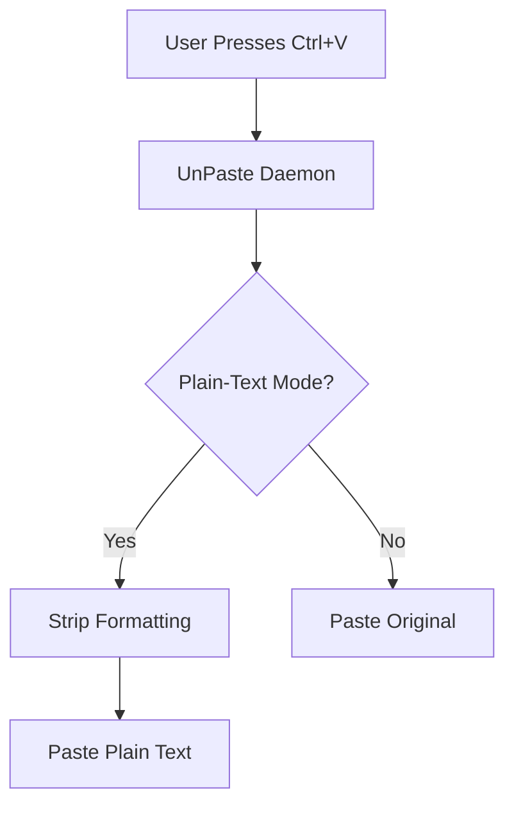

# UnPaste: Autonomous Plain-Text Pasting Utility

[](https://opensource.org/licenses/MIT)

**UnPaste** is a cross-platform background utility that automatically strips formatting from text when pasting (`Ctrl+V`), eliminating the need for intermediate tools like Notepad. Inspired by [this r/SomebodyMakeThis request](https://www.reddit.com/r/SomebodyMakeThis/comments/bnnw3/a_background_app_that_while_running_will_always/).

## Problem
Copying formatted text from applications (e.g., Microsoft Word, Excel, web pages) into other apps (e.g., email clients, web forms) often retains unwanted formatting (fonts, colors, tables). Users typically paste into Notepad first to remove formatting, then re-copy/paste.

## Solution
UnPaste runs as a background daemon and overrides `Ctrl+V` to paste **plain text only** by default. Formatting can be restored via a toggle (e.g., `Ctrl+Shift+V`).

## Features
- **Cross-Platform**: Windows, macOS, and Linux.
- **Background Daemon**: Runs silently in the system tray or as a CLI process.
- **Toggle Mode**: Enable/disable plain-text pasting via hotkey or CLI.
- **Minimal Dependencies**: Uses `pyperclip` and `pynput` for clipboard/hotkey management.

## Installation
```bash
pip install unpaste
```

## Usage
### CLI Mode
```bash
# Start the daemon (runs in background)
unpaste start

# Stop the daemon
unpaste stop

# Toggle plain-text pasting (default: enabled)
unpaste toggle
```

### System Tray Mode (Windows/macOS)
- Launch `unpaste-tray` to run in the background with a system tray icon.
- Right-click the tray icon to toggle or exit.

## Technical Architecture


### Platform-Specific Implementation
| Platform | Clipboard Library       | Hotkey Library          |
|----------|-------------------------|--------------------------|
| Windows  | `pywin32`               | `pynput`                 |
| macOS    | `pyobjc` (AppleScript)  | `pynput`                 |
| Linux    | `xclip`/`xsel`          | `pynput` (X11)           |

## Development
### Prerequisites
- Python 3.11+
- `pip install pyperclip pynput click`

### Build & Test
#### Option 1: Virtual Environment (Recommended)
```bash
python -m venv venv
source venv/bin/activate  # Linux/macOS
# venv\Scripts\activate  # Windows
pip install -e .
pytest tests/
```

#### Option 2: Standalone Tests (No Installation)
```bash
python tests/test_standalone.py
```

## License
MIT. See [LICENSE](LICENSE) for details.

## Roadmap
- [ ] Add GUI configuration panel.
- [ ] Support for additional hotkeys (e.g., middle-click paste).
- [ ] Browser extension for web apps.

---
**Autonomously developed by [Femirins](https://github.com/femirins)**